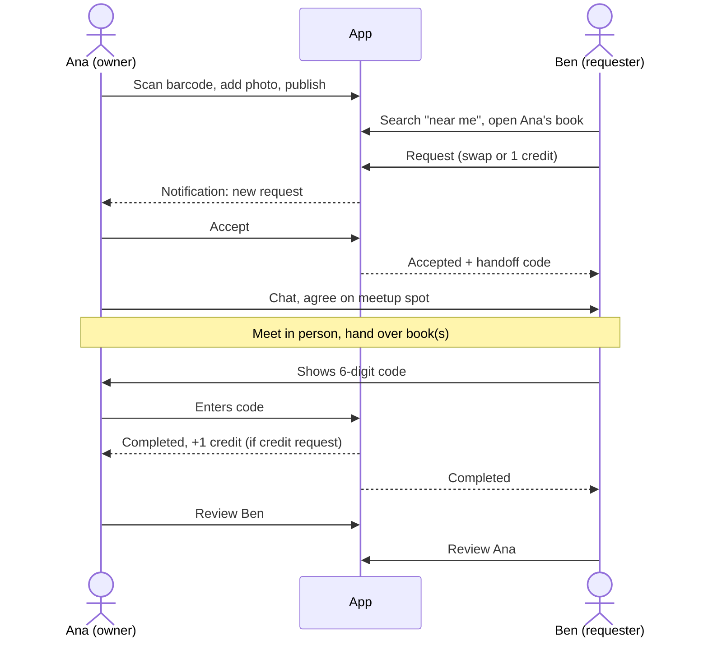
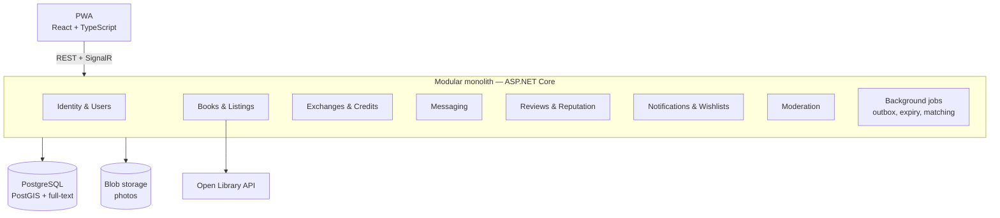
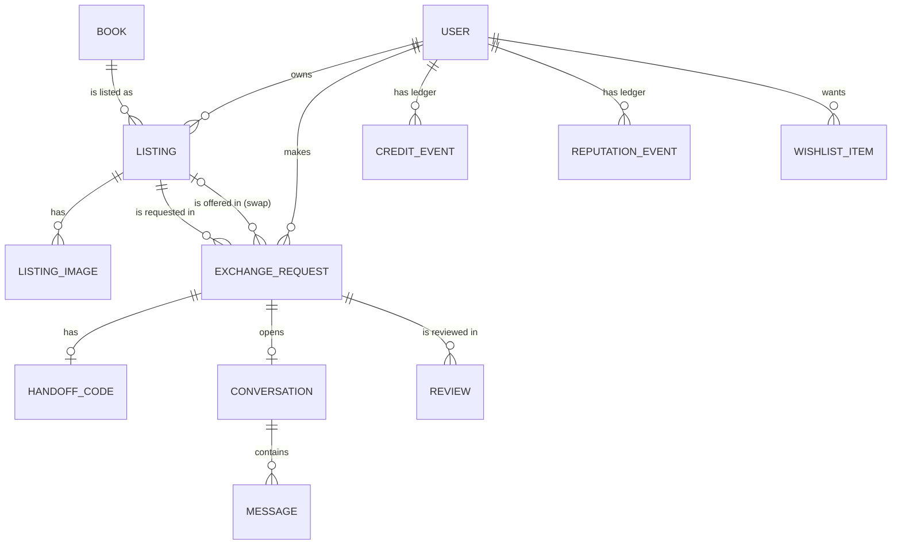
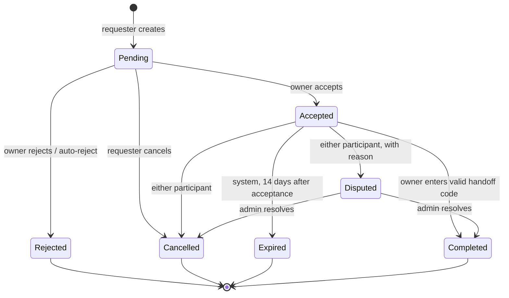

# Book Exchange Platform — Specification v2

> Single source of truth for product, architecture, and delivery.
> Rules are numbered (`R-x`) so they can be cited in plans, commits, and reviews.

## Contents

1. [Overview](#1-overview)
2. [Product](#2-product)
3. [Technology stack](#3-technology-stack)
4. [Architecture](#4-architecture)
5. [Domain model](#5-domain-model)
6. [Business rules](#6-business-rules)
7. [Authorization](#7-authorization)
8. [Authentication](#8-authentication)
9. [API conventions](#9-api-conventions)
10. [Persistence, security, observability](#10-persistence-security-observability)
11. [Frontend](#11-frontend)
12. [Testing](#12-testing)
13. [Working agreement](#13-working-agreement)
14. [Delivery plan](#14-delivery-plan)
15. [Definition of Done](#15-definition-of-done)
16. [Roadmap and success metrics](#16-roadmap-and-success-metrics)
17. [Glossary](#17-glossary)

**Precedence when rules conflict:**
Security > Data integrity > Business rules > Test coverage > Architecture cleanliness > Delivery speed.

---

## 1. Overview

A **hyperlocal book exchange** delivered as a Progressive Web App. People list books they own, find books near them, and hand them over in person, either as a **direct swap** or by spending a **book credit**.

### The problem we design around

A one-for-one swap only happens when two people near each other each want what the other has. On a young platform this rarely lines up, so swap marketplaces stay empty. Every product decision here aims to **raise the chance that a listed book finds a reader**:

| Lever | Feature |
|---|---|
| Break the "I want yours, you want mine" requirement | Book credits |
| Make supply cheap to create | 30-second listing via barcode scan + auto-filled metadata |
| Make distance work for us | Location-first search, launch in one dense community |
| Turn browsing into matches | Wishlists with nearby-match notifications |
| Make strangers willing to meet | Handoff codes, reputation, suggested meetup spots |

### Target user journey



---

## 2. Product

### 2.1 In scope (v1)

- Register, confirm email, log in, manage profile and home area
- List books with barcode scan, ISBN metadata lookup, and up to 8 photos
- Search and browse nearby books (radius, text, filters)
- Public questions and answers on listings
- Request a book via **swap** or **credit**
- Accept or reject requests; private real-time chat after acceptance
- Complete handoffs with a **handoff code**
- Book credit ledger
- Reviews and auditable reputation
- Wishlists with match notifications
- In-app and web-push notifications
- Reporting and admin moderation, including dispute resolution

### 2.2 Out of scope (v1)

Payments, shipping, multi-book bundles, three-way swap cycles, public chat, social login, native mobile apps.

---

## 3. Technology stack

| Layer | Technology |
|---|---|
| Frontend | React, TypeScript, Vite, Tailwind CSS, TanStack Query, PWA (service worker, web manifest, web push) |
| Barcode scanning | JS library (e.g. ZXing), since Safari lacks `BarcodeDetector` |
| Backend | .NET 10, ASP.NET Core Web API, EF Core, FluentValidation, SignalR (in-process) |
| Database | PostgreSQL + **PostGIS** (geo) + built-in full-text search (`tsvector`) |
| Background work | `BackgroundService` + transactional outbox table |
| Rate limiting | ASP.NET Core built-in rate limiter |
| Book metadata | Open Library API behind `IBookMetadataProvider` |
| File storage | Azure Blob (prod), Azurite or local disk (dev/test), behind `IFileStorage` |
| Auth | ASP.NET Core Identity + JWT access tokens + rotating refresh tokens |
| Tests | xUnit, FluentAssertions, Testcontainers (PostGIS image), Vitest + Testing Library |
| Observability | Serilog (structured), OpenTelemetry → Azure Application Insights |
| Delivery | Docker, Docker Compose, GitHub Actions |
| Hosting | Azure Container Apps, Azure Database for PostgreSQL Flexible Server (Burstable), Azure Blob Storage |

**R-1** Add a dependency only when it removes more complexity than it adds; justify each new package in the phase report. No MediatR, AutoMapper, generic repositories, or CQRS frameworks unless a concrete problem demands it.
**R-2** Verify every package and version with real `dotnet add package` / `npm install` output, never from memory.
**R-3** **No Redis and no message broker in v1.** Introduce Redis (and Azure SignalR Service) only when running more than one API instance; record that decision as an ADR.

---

## 4. Architecture

### 4.1 System view



**R-4** Modular monolith: one deployable API, no microservices.

### 4.2 Solution layout

```
src/
  BookExchange.Domain/          # Entities, enums, value objects, domain rules, domain events. BCL only.
  BookExchange.Application/     # Use cases, DTOs, validators, interfaces (IFileStorage, IEmailSender,
                                # IBookMetadataProvider, IPushSender, IClock, ...)
  BookExchange.Infrastructure/  # EF Core, PostgreSQL/PostGIS, Blob, Identity, email, push, Open Library,
                                # outbox processor, background jobs
  BookExchange.Api/             # Endpoints, SignalR hubs, auth pipeline, middleware, composition root
tests/
  BookExchange.UnitTests/       # Domain + application logic, no I/O
  BookExchange.IntegrationTests/# Real PostGIS via Testcontainers; API via WebApplicationFactory
frontend/                       # Vite + React PWA
docs/                           # SPEC.md, PLAN.md, ADRs
```

Modules (folders inside each layer): `Identity`, `Users`, `Books`, `Listings`, `Exchanges`, `Credits`, `Messaging`, `Reviews`, `Reputation`, `Notifications`, `Wishlists`, `Moderation`, `Shared`.

**R-5** Dependencies point inward: `Api → Infrastructure → Application → Domain`. Domain never references EF Core or Infrastructure.
**R-6** Modules communicate through Application interfaces or in-process domain events, never by reaching into another module's tables, except via documented `Shared` read models.
**R-7** All business rules live in Domain/Application. Frontend and DTO validation are usability layers, not the security boundary.
**R-8** Prefer explicit, readable code over clever abstractions.

### 4.3 Background work (outbox)

Domain events that must trigger side effects outside the transaction (notifications, emails, web push, wishlist matching) are written to an `OutboxMessage` table **in the same transaction** as the state change. A `BackgroundService` processes them with retries and idempotency keys. Scheduled jobs (exchange expiry, handoff-code lock cleanup) run in the same host.

---

## 5. Domain model

### 5.1 Entities

| Area | Entities |
|---|---|
| Identity & users | `User`, `UserProfile` (display name, bio, home area label, home point), `RefreshToken`, `PushSubscription` |
| Catalog | `Book` (ISBN, title, authors, categories, cover URL), `Listing`, `ListingImage`, `ListingQuestion`, `ListingAnswer` |
| Exchanges | `ExchangeRequest`, `HandoffCode` |
| Credits | `CreditEvent` |
| Messaging | `Conversation`, `ConversationParticipant`, `Message` |
| Trust | `Review`, `ReputationEvent`, `Report` |
| Engagement | `Notification`, `WishlistItem`, `MeetupSpot` |
| Infrastructure | `OutboxMessage` |

### 5.2 Enums

```
ListingStatus        { Draft, Active, Reserved, Exchanged, Archived }
BookCondition        { New, LikeNew, Good, Fair, Worn }
ExchangeKind         { Swap, Credit }
ExchangeStatus       { Pending, Accepted, Rejected, Cancelled, Expired, Disputed, Completed }
CreditEventType      { Starter, Held, Released, Spent, Earned, AdminAdjustment }
ReputationEventType  { ExchangeCompleted, PositiveReview, NegativeReview, ReportPenalty, AdministrativeAdjustment }
NotificationType     { RequestReceived, RequestAccepted, RequestRejected, RequestCancelled, RequestExpired,
                       ExchangeDisputed, ExchangeCompleted, NewMessage, QuestionReceived, QuestionAnswered,
                       ReviewReceived, WishlistMatch, HandoffCodeLocked }
ReportType           { Spam, Inappropriate, NoShow, Fraud, Other }
ReportStatus         { Open, Resolved, Dismissed }
UserRole             { User, Admin }
```

### 5.3 Core relationships



**R-9** IDs are server-generated GUIDs (UUIDv7 preferred). All timestamps are UTC (`timestamptz`).
**R-10** Never accept server-controlled fields from clients: `OwnerId`, `RequesterId`, `Status`, `CreatedAt`, credit or reputation values, coordinates of other users.

---

## 6. Business rules

### 6.1 Exchange requests

An `ExchangeRequest` always targets **one requested listing** and is one of two kinds:

| Kind | Requester gives | Owner receives |
|---|---|---|
| `Swap` | One of their own `Active` listings | That book |
| `Credit` | 1 book credit (held on accept, spent on completion) | 1 credit on completion |

#### State machine



**R-11** Any transition not shown above throws a domain exception and is covered by a test.

#### Preconditions for creating a request

- Requested listing is `Active` and not owned by the requester.
- `Swap`: offered listing is `Active` and owned by the requester.
- `Credit`: requester's **available** credit balance ≥ 1 at creation (re-checked on accept).
- No other `Pending` or `Accepted` request exists between the same listings (swap) or the same requester and listing (credit).
- A requester may have at most 10 `Pending` requests at once (anti-spam; configurable).

#### Side effects (same transaction)

| Transition | Effects |
|---|---|
| → `Accepted` | Involved listings → `Reserved`. Competing `Pending` requests on those listings → `Rejected` (notify). Conversation created with exactly the two participants. Handoff code generated. `Credit`: `CreditEvent(Held, -1)` for requester. |
| → `Completed` | Involved listings → `Exchanged`. `Credit`: `Spent` for requester (finalizes the hold) and `Earned, +1` for owner. `ReputationEvent(ExchangeCompleted)` for both. Conversation stays readable, becomes read-only after 30 days. |
| → `Cancelled` / `Expired` from `Accepted` | Involved listings → `Active`. `Credit`: `Released, +1` for requester. |
| → `Disputed` | Listings stay `Reserved`. A `Report` is created and assigned to the admin queue. |

**R-12** Use EF Core concurrency tokens on `ExchangeRequest` and `Listing`; two simultaneous accepts on the same listing produce exactly one success and one `409 Conflict`.

### 6.2 Handoff code

- Generated on accept: 6 digits from a cryptographically secure RNG, stored **hashed**.
- Visible only to the **requester** (the person receiving the requested book), in the exchange screen as digits and a QR code.
- At the meetup, the **owner** enters or scans the code, which completes the exchange.
- Max **5 failed attempts** per exchange; then the code locks, both participants are notified, and only a new code (requester action, max 2 regenerations) or an admin can unlock it.
- The verify endpoint is rate-limited per user and per exchange.

### 6.3 Book credits

- **R-13** There is no editable balance column. Balance = sum of `CreditEvent.Amount` for the user. An aggregate may be cached on `UserProfile` but must be recomputed in the same transaction as each new event.
- `CreditEvent { Id, UserId, Type, Amount, ExchangeRequestId?, Description, CreatedAt }`.
- **Available balance** (total minus held) can never go negative; enforced in the domain and tested under concurrent spends.
- One `Starter` credit per user, granted once on email confirmation.
- Credits are earned only on completed handoffs, never on listing.
- `AdminAdjustment` requires a mandatory description and is audited.
- Credits have no monetary value and cannot be transferred, bought, or sold.

### 6.4 Listings, search, and location

- Listing fields: `Id, OwnerId, BookId, Description, Condition, Location (PostGIS point), AreaLabel, Status, CreatedAt, UpdatedAt`.
- Creating a listing: client scans or types an ISBN → API calls `IBookMetadataProvider` → existing `Book` reused or created → user confirms or edits metadata, adds condition and photos. Manual entry is allowed when the ISBN lookup fails.
- Location defaults to the user's home point; it may be changed per listing.
- **R-14** Exact coordinates are never exposed to anyone but the owner. Public responses return `distanceKm` (rounded to 0.5 km) and `AreaLabel` only.
- Search: full-text on title/author, filters for ISBN, category, condition, radius (default 5 km, max 50 km); sort by distance (default), newest, or title. Always paginated with `PagedResult<T>`, hard cap 50 per page. Public search returns `Active` listings only.
- Questions: any authenticated user may ask on an `Active` listing; only the owner answers; questions and answers are public and paginated.

### 6.5 Wishlists

- `WishlistItem { Id, UserId, Isbn, CreatedAt }`, max 50 per user, unique per `(UserId, Isbn)`.
- When a listing becomes `Active`, an outbox job finds wishlist items with the same ISBN whose owner's home point is within their search radius, and creates a `WishlistMatch` notification. At most one notification per user per listing.

### 6.6 Messaging

- SignalR hub authenticated with the JWT (`access_token` query parameter for WebSockets).
- **R-15** Every hub method and REST endpoint re-validates conversation membership from the database.
- Messaging is only available once an exchange is `Accepted`.
- Messages persisted; cursor-based history on `(CreatedAt, Id)`; read receipts; unread count per conversation; real-time delivery to connected participants.
- The conversation screen shows suggested `MeetupSpot`s (libraries, cafés, campus buildings) near the midpoint of the two participants' areas. Spots are curated by admins.

### 6.7 Reviews and reputation

- `Review { ReviewerId, ReviewedUserId, ExchangeRequestId, Rating 1–5, Comment, CreatedAt }`; unique on `(ExchangeRequestId, ReviewerId)`; only after `Completed`; only about the other participant.
- **R-16** Reputation, like credits, is a ledger: `ReputationEvent { Id, UserId, EventType, Points, ReferenceId, Description, CreatedAt }`, score derived from the sum.
- Rating ≥ 4 → `PositiveReview`; ≤ 2 → `NegativeReview`; 3 → no event.
- Public profile shows: reputation score, completed exchanges, average rating, review count, member since, area label.

### 6.8 Notifications

- `Notification { Id, UserId, Type, Title, Message, ReferenceId, IsRead, CreatedAt }` for every `NotificationType`.
- Delivered in-app (real-time via SignalR), by **web push** to registered `PushSubscription`s, and by email for `RequestAccepted` and `ExchangeDisputed` (fallback for users without push).
- Endpoints: paginated list, mark read, mark all read, unread count.

### 6.9 Moderation

- Any user can report a user, listing, or message with a `ReportType` and reason. The reporter's identity is never shown to the reported party.
- Admin endpoints: list and filter reports, resolve or dismiss, archive listings, resolve disputes (→ `Completed` or `Cancelled`), apply `ReportPenalty` reputation events and `AdminAdjustment` credit events (description mandatory, audited), manage meetup spots.
- Seed one admin user in Development.

### 6.10 Images

- `IFileStorage` interface; Azure Blob in production, Azurite/local disk in dev and tests.
- Validate by **magic bytes**, not extension or `Content-Type`; allow JPEG, PNG, WebP; max 5 MB each; max 8 per listing.
- Strip EXIF metadata (location privacy); generate a thumbnail and a display size; store under GUID names, never the original file name.

---

## 7. Authorization

Enforced server-side on every endpoint and hub method.

| Action | Allowed principal |
|---|---|
| Edit / archive listing, upload images | Listing owner |
| Answer a listing question | Listing owner |
| Create request | Authenticated user who doesn't own the requested listing |
| Accept / reject request | Requested-listing owner |
| Cancel `Pending` request | Requester |
| Cancel `Accepted` exchange, open dispute | Either participant |
| View handoff code | Requester only |
| Enter handoff code | Requested-listing owner only |
| Read conversation / send message | Conversation participant (verified from DB) |
| Create review | Participant of a `Completed` exchange, about the other participant, once |
| View own credit ledger | That user |
| Manage wishlist | That user |
| Reports, disputes, penalties, adjustments, meetup spots | Admin |
| Modify credits or reputation | Nobody via API, except audited admin adjustments |

**R-17** Return `404` for resources the caller may not know exist (anti-enumeration); return `403` only when existence is already public (e.g. editing someone else's public listing).

---

## 8. Authentication

Endpoints under `/api/auth`: `register`, `login`, `refresh`, `logout`, `forgot-password`, `reset-password`, `confirm-email`, `me`, `change-password`. Profile under `/api/users/me`.

**R-18** Refresh tokens are opaque, random, stored hashed, single-use (rotate on every refresh), revocable per token and per user, and expire. Reusing a rotated token revokes the whole token family.
**R-19** Register, login, and forgot-password return identical responses whether or not the email exists. Rate-limit `login`, `register`, `forgot-password`, `refresh`, and handoff-code verification.
**R-20** Never log or return passwords, tokens, handoff codes, secrets, or reset links. The development `IEmailSender` logs only that an email would be sent.
**R-21** Access token held in memory on the client; refresh token in an `HttpOnly; Secure; SameSite=Strict` cookie.

---

## 9. API conventions

Routes: `/api/auth`, `/api/users`, `/api/books`, `/api/listings`, `/api/exchanges`, `/api/credits`, `/api/conversations`, `/api/reviews`, `/api/notifications`, `/api/wishlist`, `/api/reports`, `/api/admin`.

**R-22** RESTful routes and correct status codes: `201` + `Location` on create, `204` on delete, `409` for state-machine and concurrency conflicts, `422` for validation errors. All errors are RFC 7807 `ProblemDetails` from one global exception handler; stack traces never leave the server.
**R-23** FluentValidation for every request DTO; domain rules stay in the domain even when a validator also checks them.
**R-24** OpenAPI document at `/openapi/v1.json` in Development.

---

## 10. Persistence, security, observability

### 10.1 Database

- EF Core migrations committed. Applied automatically in Development via a startup switch, by an explicit CI/CD step in production, never implicitly in production.
- Delete behavior defaults to `Restrict`; `Cascade` only for true child rows (`ListingImage`, `Message`).

| Index | Purpose |
|---|---|
| GiST on `Listing.Location` | Radius search |
| GIN on `Book` search vector (title + authors) | Full-text search |
| `Book.Isbn` (unique) | Metadata reuse, wishlist matching |
| `(Listing.Status, CreatedAt)`, `Listing.OwnerId` | Browse, My Listings |
| `ExchangeRequest.(RequestedListingId, Status)`, `.RequesterId`, `.OwnerId` | Request lists, conflict checks |
| `CreditEvent.UserId`, `ReputationEvent.UserId` | Balance and score |
| `(Message.ConversationId, CreatedAt, Id)` | Cursor pagination |
| `Notification.(UserId, IsRead)` | Unread counts |
| `WishlistItem.(UserId, Isbn)` (unique), `WishlistItem.Isbn` | Matching |
| `RefreshToken.TokenHash` (unique) | Token lookup |
| `Review.(ExchangeRequestId, ReviewerId)` (unique) | One review each |
| `OutboxMessage.(ProcessedAt, CreatedAt)` | Outbox polling |

### 10.2 Security checklist (address and test where feasible)

Broken authorization / IDOR · mass assignment · SQL injection (EF parameterization) · XSS (React escaping, no `dangerouslySetInnerHTML`) · CSRF (bearer token in memory, strict refresh cookie) · malicious uploads · EXIF location leaks · brute force on login and handoff codes · token theft and reuse · enumeration · exact-location exposure · credit double-spend · sensitive data in logs. Explicit CORS; standard security headers.

### 10.3 Observability

- Serilog structured logs enriched with `RequestId`, `CorrelationId`, `UserId`, operation name, duration.
- OpenTelemetry traces and metrics for HTTP, EF Core, HttpClient, background jobs, and exceptions; OTLP exporter configured via environment; Application Insights as the Azure target.
- Business metrics emitted as counters: requests created, accepted, completed, expired; listings created; wishlist matches.

---

## 11. Frontend

### 11.1 Structure

`src/features/{auth,listings,search,exchanges,credits,messages,reviews,notifications,wishlist,profile,admin}` plus `components/`, `hooks/`, `services/` (single API client), `types/`, `utils/`.

### 11.2 Pages

| Area | Pages |
|---|---|
| Public | Home, Browse/Search, Listing Details, Public Profile |
| Auth | Register, Login, Forgot Password, Reset Password, Confirm Email |
| Listings | Create Listing (scan flow), Edit Listing, My Listings |
| Exchanges | My Exchanges, Exchange Details (handoff code / code entry, status, dispute) |
| Social | Messages (list + conversation with meetup spots), Notifications |
| Account | My Profile, Credits (balance + ledger), Wishlist, Settings (incl. push opt-in) |
| Admin | Reports, Disputes, Meetup Spots |

### 11.3 Rules

**R-25** One centralized API client: attaches the access token, silently refreshes once on `401` and retries, de-duplicates concurrent refreshes, normalizes `ProblemDetails` into a typed error, supports `AbortSignal`. No raw `fetch` in components.
**R-26** TanStack Query owns all server state: query-key factory per feature, explicit invalidation after mutations, optimistic updates only for low-risk idempotent actions (mark read).
**R-27** Every page handles loading, empty, and error states; client validation mirrors server rules; destructive actions need confirmation; toasts for mutation results; image previews; unread indicators; mobile-first, tested at 375 px and 1280 px.
**R-28** PWA: installable manifest, service worker caching the app shell, offline fallback page, web push opt-in after the user's first accepted exchange (with an install prompt on iOS, where push requires home-screen installation).
**R-29** Quality gates: `tsc --noEmit`, ESLint, Prettier check, Vitest + Testing Library covering the API client, auth flow, request form, and handoff-code entry.

### 11.4 Visual design system

Calm, paper-like interface. Tokens defined once in Tailwind's theme; no raw hex in components.

| Token | Hex | Use |
|---|---|---|
| `primary` | `#2F5D50` | Primary buttons, active nav, links, focus rings |
| `primary-dark` | `#1F4037` | Hover/pressed, header/footer, emphasis text |
| `secondary` | `#C9785D` | Secondary CTAs ("Request this book"), tags, selected chips |
| `accent` | `#D9A441` | Rating stars, unread badges, reputation and credit markers |
| `background` | `#F7F4ED` | Page background |
| `surface` | `#FFFDF8` | Cards, modals, inputs |
| `text` | `#252525` | Body and headings |
| `text-muted` | `#706D67` | Metadata, timestamps, placeholders (≥ 14 px only) |
| `border` | `#DED9CF` | Borders, dividers |
| `success` | `#3E7C59` | Success, Accepted, Completed |
| `error` | `#B94A48` | Errors, Rejected, destructive actions |

- Proportions per screen: ~70 % background/surface, ~20 % primary, ~10 % secondary/accent.
- Text on `primary`, `primary-dark`, `secondary`, `success`, `error` fills uses `surface`; text on `accent` fills uses `text`.
- **Status badges are always filled badges with a label**, never colored text alone:
  - Exchange: Pending = `accent` fill + `text`; Accepted/Completed = `success`; Rejected = `error`; Cancelled/Expired = `text-muted` fill + `surface`; Disputed = `secondary`.
  - Listing: Active = `primary`; Reserved = `accent`; Exchanged/Archived = `text-muted`.
- All text/background pairs meet WCAG AA, verified by an automated token-contrast test.
- Visible focus: 2 px `primary` ring with `surface` offset.
- Document tokens and usage in `frontend/DESIGN.md`. No dark theme in v1.

---

## 12. Testing

**R-30** Tests are a deliverable. No skipped tests, no order dependence, no shared mutable state. Each integration test class gets an isolated database (Testcontainers PostGIS + Respawn or fresh schema).

| Area | Must cover |
|---|---|
| Identity | Register, login, refresh rotation, reuse revokes family, logout, password reset, enumeration-safe responses, rate limits |
| Listings | ISBN lookup (fake provider) + manual fallback, CRUD, owner-only edits (403/404), image validation (magic bytes, size, count, EXIF stripped), radius search, full-text search, pagination cap, **coordinates never exposed** |
| Exchanges | Every legal transition; **every illegal transition**; self-request rejected; non-owner accept rejected; competing requests auto-rejected; concurrent accepts → one 409; listing side effects; expiry job |
| Handoff code | Only requester sees it; only owner enters it; wrong code counts attempts; lock after 5; regeneration limit; hashed at rest |
| Credits | Starter granted once; hold on accept; spend + earn on completion; release on cancel/expire/reject; **no negative available balance under concurrent requests**; balance equals event sum |
| Messaging | Non-participants blocked (REST and hub); blocked before acceptance; history pagination; unread counts |
| Reviews / reputation | Only after completion; no duplicates; no self-review; correct events; score equals event sum |
| Wishlists | Match within radius notifies once; outside radius doesn't |
| Notifications | Each trigger produces the expected notification; outbox retries are idempotent |
| Moderation | Non-admins blocked; dispute resolution both ways; penalties and adjustments audited |
| End to end | `FullExchangeJourneyTests` drives the API through the journey in §15 for **both** a credit request and a swap |

---

## 13. Working agreement

**Decide alone:** naming, folder layout within §4.2, DTO shapes, index details, UI layout and copy, small UI libraries, sensible defaults for unspecified limits (state them in the phase report).

**Ask first (one question, with your recommendation):** stack changes, changing the state machine or authorization matrix, adding paid Azure services, removing working functionality, changing the public API after Phase 6, anything that deletes user data.

**Never:** commit secrets; skip or disable failing tests; weaken authorization to make something work; mark a phase complete with failing builds or tests; fabricate results. Paste real command output.

---

## 14. Delivery plan

Each phase: **Analyze → Plan → Implement → Test → Review → Fix → Verify**, ending with a Phase Report (≤ 25 lines: what changed, commands and results, new dependencies and why, decisions taken, known gaps). **Stop for approval after each phase.**

The plan delivers a **working vertical slice of the core journey early** (Phase 8), then widens.

| # | Phase | Exit criteria |
|---|---|---|
| 1 | Inspect repository | Summary of existing code, reuse, gaps. Nothing overwritten. |
| 2 | Implementation plan | `docs/PLAN.md`: ADRs, dependency list, domain model for Exchanges + Credits, top risks, open questions. |
| 3 | Skeleton + infra | Solution builds; Compose starts api, frontend, PostGIS, Azurite; health endpoint green; CI runs build + tests on PRs. |
| 4 | Identity + Users | §8 endpoints, home area, auth pipeline; Identity tests pass. |
| 5 | Books + Listings | ISBN lookup, CRUD, images, geo + text search; Listings tests pass. |
| 6 | Exchanges + Credits + Handoff | Full state machine, credit ledger, handoff codes, expiry job, concurrency; all related tests pass. |
| 7 | Messaging | Hub + REST history + meetup spots; authorization tests pass. |
| 8 | **Core vertical slice (frontend)** | Register → list via scan → search nearby → request → accept → chat → handoff code → completed, working in the browser on a phone viewport. |
| 9 | Reviews + Reputation | Events, derived score, public profile; tests pass. |
| 10 | Notifications + web push | Outbox processor, all triggers, push subscriptions, email fallback; tests pass. |
| 11 | Wishlists | CRUD + matching job; tests pass. |
| 12 | Moderation | Reports, disputes, penalties, adjustments, admin pages; tests pass. |
| 13 | Frontend completion + PWA | All pages in §11.2, R-27 to R-29 green, installable PWA, offline fallback. |
| 14 | Test completion | §12 table fully satisfied; `FullExchangeJourneyTests` green for swap and credit. |
| 15 | Docker + CI/CD | Multi-stage non-root images, `.env.example`, dev-only seed data; PR workflow and main workflow with gated Azure deploy. |
| 16 | Security + architecture review | §10.2 walked item by item with evidence; no critical/high findings open. |
| 17 | Documentation | README (§15 item 6) with Mermaid diagrams; final audit table. |

**Seed data (Development only, idempotent):** ≥ 6 users incl. one admin, spread across two nearby areas; ≥ 20 listings across all conditions and statuses; requests of both kinds in every state; ≥ 2 completed exchanges with reviews, credit and reputation events; messages; notifications; wishlist items with at least one match; ≥ 5 meetup spots.

---

## 15. Definition of Done

All of the following hold, with evidence in the final report:

1. `docker compose up` on a clean machine starts the full system, and this journey succeeds **in the browser and in `FullExchangeJourneyTests`**:
   Register A → confirm email (starter credit) → set home area → list Book A by ISBN → Register B → list Book B → B searches nearby and opens Book A → B asks a question → A answers → B requests Book A with a credit → A gets a notification → A accepts → chat both ways in real time → B shows the handoff code → A enters it → exchange completed, A +1 credit, B −1 credit → both review → reputations and profiles update. Repeat with a **swap** request.
2. `dotnet build` and `dotnet test` pass, with warnings as errors in Domain/Application; frontend `tsc`, lint, and tests pass.
3. Every row of §12 has passing tests.
4. Every row of §7 has at least one negative test.
5. No secrets in the repository; `.env.example` documents every variable.
6. README covers: purpose, architecture, stack, repo structure, local and Docker setup, migrations, testing, environment variables, auth flow, exchange workflow, credits, handoff codes, messaging, reputation, CI/CD, Azure deployment.
7. Final audit table: **Area | Requirement | Implementation (paths) | Tests | Status | Remaining gap**, with no critical or high gaps open.

---

## 16. Roadmap and success metrics

| Stage | Scope |
|---|---|
| **MVP** (Phases 1–8) | Scan-to-list, nearby search, credits + swaps, chat, handoff codes. Launch in one community (e.g. a single campus). |
| **v1** (Phases 9–17) | Reviews and reputation, notifications and web push, wishlists, moderation and disputes, PWA polish, production deployment. |
| **v2** (future) | Three-way swap cycles, group shelves (book clubs, schools), multiple communities, Redis + Azure SignalR Service when scaling out, optional native wrapper via Capacitor. |

| Metric | Why it matters |
|---|---|
| Completed exchanges per active user per month | Overall health |
| Time from listing to first request | Liquidity |
| Requests accepted → completed rate | Trust and handoff friction |
| Expired + disputed share of accepted exchanges | No-shows and conflict |
| Listings created per new user in first week | Supply onboarding |
| Wishlist matches that become requests | Matching value |

---

## 17. Glossary

| Term | Meaning |
|---|---|
| **Listing** | A physical copy of a book a user offers |
| **Request** | An `ExchangeRequest`: someone asking for a listing, via swap or credit |
| **Swap** | Request where the requester offers one of their own listings |
| **Credit** | Non-monetary unit; earned by giving a book, spent to request one |
| **Held credit** | A credit reserved by an accepted credit request, not yet spent |
| **Handoff code** | 6-digit code the receiver shows at the meetup; entering it completes the exchange |
| **Home area** | A user's approximate location, used for search radius and wishlist matching |
| **Outbox** | Table of pending side effects written in the same transaction as the state change |
| **Liquidity** | How likely a listed book is to find a nearby reader |
